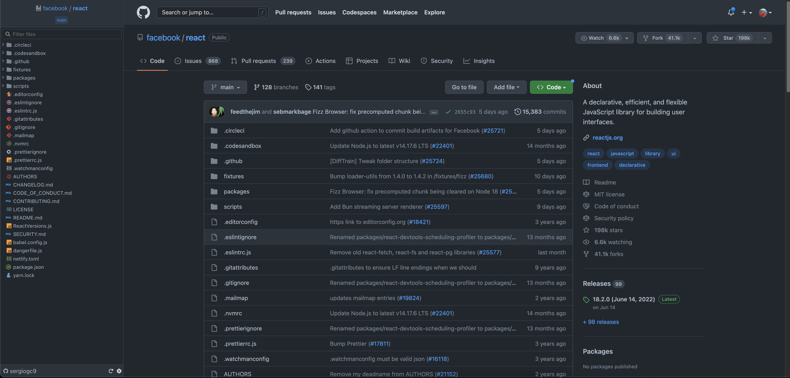
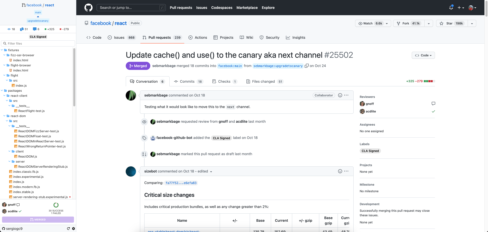

  

<h1 align="center">Awesome Github</h1>

**Awesome Github** is a Google Chrome extension which adds a sidebar in code and pull requests Github pages and a popup to be aware of the latest changes in your opened pull requests.

This extension is focused on improving the developer experience while using Github.

    
Screenshots

  
  
  
  
  
  
  

## Features

This extensions adds a **sidebar** at left of the page in code and pull requests Github pages. It shows the repository tree with some nice search and filter features.

It also adds a **popup** visible when clicking the extension icon in which you can see all you Github pull requests you are somehow related, (e.g. you created it, you are a reviewer, you commented it, etc.).

🌞🌚 Supports all **light** and **dark** Github modes!

#### Sidebar

If you are in a page **repository source page**:

- List repository tree.
- Search and filter by file name.
- Detect the branch showing the files in that branch.
- Possibility to lazy load sub directories, useful for big repositories.
- Go to file when clicking on it.

If you are in a **pull request page**:

- List the files changed in the PR.
- Search and filter by file name.
- Show some data about the PR, e.g. number of commits, comments, files added and removed, etc.
- Show if a file is added or removed.
- Show people who commented.
- Show information about checks passed or not.
- Possibility to approve or reject changes.
- Possibility to merge the PR.

⚠️ The merge button is only enabled following some conditions that I set up for my convenience. It's enabled when there is at least 1 approval, all checks are green, there are no conflicts and you have permissions to merge the PR.

In **settings page** (clicking the bottom right cog):

- Enter the Github token. It is only saved locally.
- Hide / show sidebar when being in a Github page not implemented.
- Group or not empty folders to reduce the tree size.
- Lazy load or not sub directories. If enabled, only the root directory is fetched and every sub directory is fetched when opened, otherwise the whole repository tree is fetched at the beginning.

#### Popup

Shows information about to all PR that you are somehow related:

- List all pull requests.
- Show changes since you last visited the PR, e.g. new comments, commits, etc.
- Show checks status.
- Possibility to star and hide pull requests.

## Installation

Using the Chrome web store:

https://chrome.google.com/webstore/detail/pakgmomfafjlmdeihbgjalighchkjmdc/

Loading locally using the repo:

⚠️ Node v16 required!

1. Clone the repo.
2. Install dependencies in root and in react directory:
   1. `yarn install`
   2. `cd src/html/`
   3. `yarn install `
3. Build using `yarn build`
4. Open the chrome extensions page at `chrome://extensions/`
5. Enable developer mode if not enabled.
6. Click "Load unpacked" and select the `dist` directory created at build step.

## Usage

Once installed, follow these instructions to enable all features:

1. Open a github repository url (or reload this one).
2. A sidebar should appear at left with an error message. Click on the cog at bottom right to enter into settings page.
3. Add a Github token and click on "Apply settings".
4. Reload the page and the repository tree should now appear.
5. Click on extension icon at top right of Chrome to see the popup with your related pull requests.

## Credits

Material icon icons:
https://github.com/PKief/vscode-material-icon-theme
