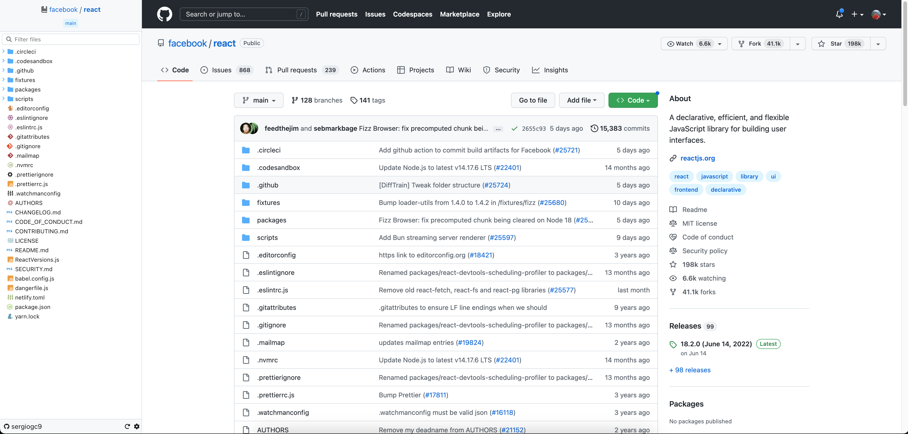
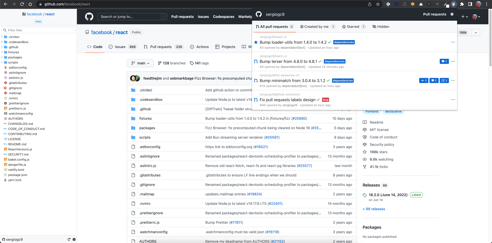

Improve your experience in Github using this extension. It adds a sidebar in code and pull request pages and a popup to see your pending pull requests.

⚠️ Disclaimer: This extension has been implemented by a developer (me) for itself, hence some features have been implemented within his job needs. The extension is also in a beta stage, which contain bugs and it is not compatible with all github pages.

## Table of contents

- [Table of contents](#table-of-contents)
- [Features](#features)
  - [Sidebar](#sidebar)
  - [Popup](#popup)
- [Installation](#installation)
- [Usage](#usage)
- [Credits](#credits)

## Features

    
Screenshots

  
  
  
  

This extensions adds a **sidebar** at left of the page in every Github page focused on showing the repository tree with a nice search and filter.

It also adds a **popup** visible when clicking the extension icon where you can see all you Github pull requests in which you are somehow related, e.g. you created it, you are a reviewer, you commented it, etc.

#### Sidebar

If you are in a page repository source page:

- List repository tree.
- Search and filter by file name.
- Detect the branch showing the files in that branch.
- Possibility to lazy load sub directories, useful for big repositories.
- Go to file when clicking on it.

If you are in a pull request page:

- List the files changed in the PR.
- Search and filter by file name.
- Show some data about the PR, e.g. number of commits, comments, files added and removed, etc.
- Show if a file is added or removed.
- Show people who commented.
- Show information about checks passed or not.
- Possibility to approve or reject changes.
- Possibility to merge the PR.

⚠️ The merge button is only enabled following some conditions that I set up for my convenience. It enables when there is at least 1 approve, all checks are green, there are no conflicts and you have permissions to merge the PR.

In settings page (clicking the bottom right cog):

- Enter the Github token. It is only saved locally.
- Hide / show sidebar when being in a Github page not implemented.
- Group or not empty folders to reduce the tree size.
- Lazy load or not sub directories. If enabled, only the root directory is fetched and every sub directory is fetched when opened, otherwise the whole repository tree is fetched at once.

#### Popup

Shows information about to all PR that you are somehow related:

- List all pull requests.
- Show changes since you last visited the PR, e.g. new comments, commits, etc.
- Show checks status.

## Installation

Using the Chrome web store:

https://chrome.google.com/webstore/detail/the-github-fox-extension/pakgmomfafjlmdeihbgjalighchkjmdc/

Loading locally using the repo:

⚠️ Node v14 required!

1. Clone the repo.
2. Install dependencies in root and in react directory:
   1. `yarn install`
   2. `cd src/html/`
   3. `yarn install `
3. Build using `yarn build`
4. Open the chrome extensions page at `chrome://extensions/`
5. Enable developer mode if not enabled.
6. Click "Load unpacked" and select the `dist` directory created at build step.

## Usage

Once installed, follow these instructions to enable all features:

1. Open a github repository url (or reload this one).
2. A sidebar should appear at left with an error message. Click on the cog at bottom right to enter into settings page.
3. Add a Github token and click on "Apply settings".
4. Reload the page and the repository tree should now appear.
5. Click on extension icon at top right of Chrome to see the popup with your related pull requests.

## Credits

Material icon icons:
https://github.com/PKief/vscode-material-icon-theme
